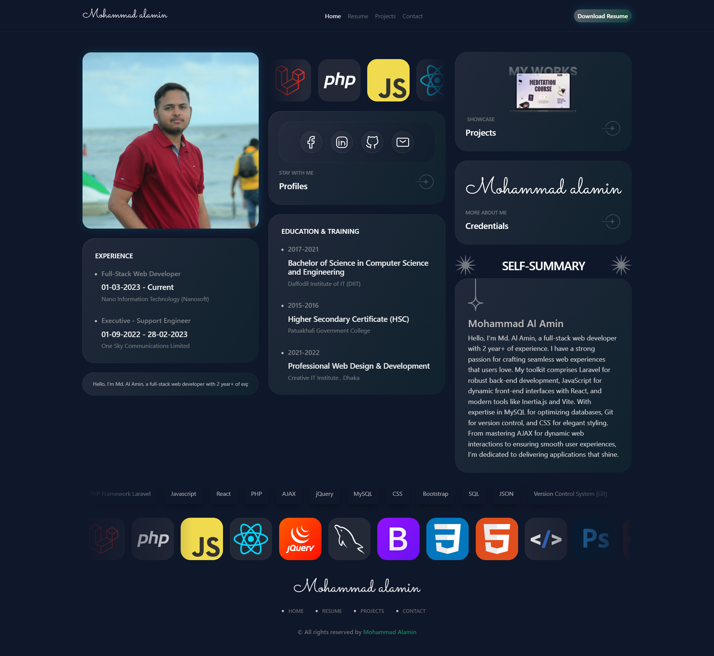
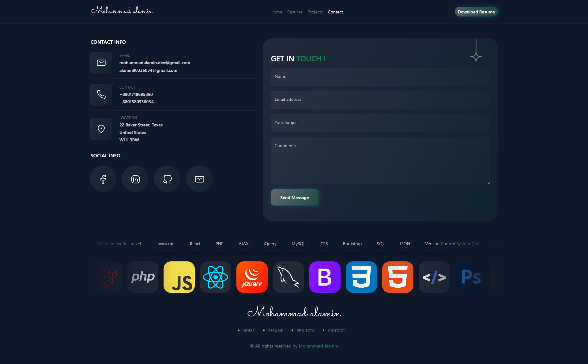

<h1 align='center'>Admin panel</h1>

<h3>Index</h3>

- **[Installation](#Installation)**
- **[Module](#Module)**
- **[Menu](#Menu)**

 <h3 id="Installation">Installation</h3>

Clone git repository to local storage
```
git clone https://github.com/alaminwebdev/md-al-amin.com.git
```
Create .env file & need .env file updated
```
cp .env.example .env
```
```
DB_CONNECTION=mysql
DB_HOST=127.0.0.1
DB_PORT=3306
DB_DATABASE=md-al-amin
DB_USERNAME=root
DB_PASSWORD=
```
Key to generate in .env
```
php artisan key:generate
```
Migrate database and get all dependency tables with data
```
php artisan migrate
```
To run test project at [localhost:8000](http://localhost:8000)
```
php artisan serve

```
<h3 id="Module">Module</h3>




<h3 id="Menu">Menu</h3>

Project list
```
/project-list/

```

Project Create
```
/project-list/create

```

Resume Upload
```
/resume-upload/

```

